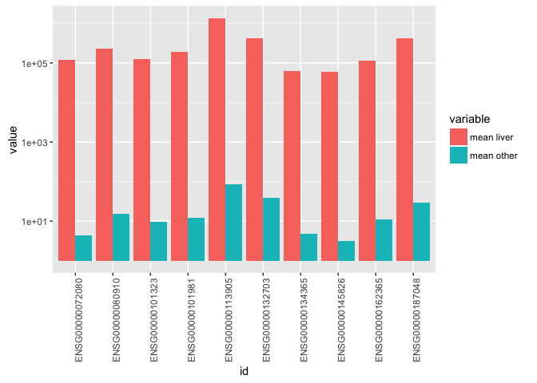

``` r
library(dplyr)
library(DESeq)
library(ggplot2)
library(reshape2)
library(plyr)
```

``` r
data <- read.table('57epigenomes.N.pc', header = T, row.names = 1)

x <- colnames(data) == 'E066'
x[x == T] <- 'liver'
x[x == F] <- 'other'

head(data)
```

    ##                 E000  E003  E004  E005  E006  E007  E011  E012  E013 E016
    ## ENSG00000000003 3211 22232 22128 17579 14068 34738 15280 55040 12300 8538
    ## ENSG00000000005   65   448  2085     0    55     1    18    36     6  165
    ## ENSG00000000419 3099  7220 14016 11705  9808 11660  5277 12636  3425 4039
    ## ENSG00000000457  579  1687  1797  6783  2270  2992  1462  4987  1081  822
    ## ENSG00000000460 2157  7170  9927  9384  1143  7155  3670  9384  2669 3117
    ## ENSG00000000938    8   127    42     6    10    10     4    11     3   22
    ##                  E024  E027 E028 E037 E038 E047  E050 E053 E054 E055 E056
    ## ENSG00000000003 39791  4789 2618   78  192  157  3083 3232 6357 1646 2110
    ## ENSG00000000005   248     0    0    0    0    2     0    6    9    0    0
    ## ENSG00000000419  8997 16459 5952 2488 2640 1980  8446  914 1164 2823 4857
    ## ENSG00000000457  2578  3049 1005 1293 1533 1290 12676  866 1304 1228 1092
    ## ENSG00000000460 10389  1423  796  998 1127  930  8225 1674 2206 1587 3847
    ## ENSG00000000938   101  2393  163  610  526 1227  3359   14    3    5    6
    ##                 E057  E058 E059 E061  E062 E065 E066 E070 E071  E079 E082
    ## ENSG00000000003 3813  6983 2084 8757    39  290 8088 4400  784 14916 1142
    ## ENSG00000000005    0     0    0    2     0    0   11    0    1    58    0
    ## ENSG00000000419 7100 12433 1255 5447  1524 1110 2364 1341  908  4576  584
    ## ENSG00000000457 1265  3504  569 3590   921  229  677  911  295  2932  703
    ## ENSG00000000460 4318  9558 1395 3579   642  126  223 2120  246  1353  628
    ## ENSG00000000938    7     3    0   10 34232  797  600  136  782  2721   96
    ##                  E084  E085 E087 E094 E095  E096  E097 E098  E100 E104
    ## ENSG00000000003 33839 45144 3553  665 1155  2285 15033 1553  2813 2293
    ## ENSG00000000005   196   127    6    0   14     0  1591   26    20   74
    ## ENSG00000000419  7765  8504 4890 1050 4846  1798  4778  905 31800 4874
    ## ENSG00000000457  7021  8710 2682  341 1257   859  2724  799 16269  850
    ## ENSG00000000460  4654  5326  639  123  372   412   995  273  1280  398
    ## ENSG00000000938  1127   649  768  594 1602 18470  1038  548  1602  748
    ##                 E105  E106 E109  E112  E113  E114  E116  E117  E118 E119
    ## ENSG00000000003 1161 14839 8000  9340  1033 24856    18 29162 30577 4700
    ## ENSG00000000005   13    46   30   288    12     0     0     0     0    0
    ## ENSG00000000419 3540  6573 8037 19539  4090 13894 15073 29788 15626 7011
    ## ENSG00000000457  941  3226 2436  8915  1302  4092  6717  7807  2096 1308
    ## ENSG00000000460  384  1670 1737  5259   640 11207 13770 37145  4418 4046
    ## ENSG00000000938 1514  4258 4565 25095 16914     2 54625    13     6   25
    ##                  E120  E122  E123  E127  E128
    ## ENSG00000000003  9693 24191   153 16160 15225
    ## ENSG00000000005     8     0     2     0     0
    ## ENSG00000000419 18256  3747 17156 27026 22065
    ## ENSG00000000457  2677  1826  5670  7557  4630
    ## ENSG00000000460  3817  4855 27078  8274  5134
    ## ENSG00000000938     1    90    11    66     0

``` r
cds <- newCountDataSet(data, x)
```

``` r
if (file.exists('res.RData')) {
  load('res.RData')
} else {
  cds <- estimateSizeFactors(cds)
  sizeFactors(cds)
  
  cds <- estimateDispersions(cds)
  plotDispEsts(cds)
  
  res <- nbinomTest(cds, 'liver', 'other')
  save(res, file = 'res.RData')
}
head(res)
```

    ##                id   baseMean   baseMeanA  baseMeanB foldChange
    ## 1 ENSG00000000003 7687.81281 34801.16482 7203.64581  0.2069944
    ## 2 ENSG00000000005   78.53013    47.33096   79.08725  1.6709412
    ## 3 ENSG00000000419 5708.72244 10171.85381 5629.02367  0.5533921
    ## 4 ENSG00000000457 2135.26900  2913.00551 2121.38085  0.7282447
    ## 5 ENSG00000000460 3013.06266   959.52766 3049.73293  3.1783689
    ## 6 ENSG00000000938 4190.55194  2581.68878 4219.28164  1.6343107
    ##   log2FoldChange      pval padj
    ## 1     -2.2723364 0.1219615    1
    ## 2      0.7406610 1.0000000    1
    ## 3     -0.8536260 0.3372818    1
    ## 4     -0.4575048 0.4092039    1
    ## 5      1.6682866 1.0000000    1
    ## 6      0.7086823 0.3839711    1

``` r
res.ordered <- res[order(res$padj),]
top10 <- head(res.ordered, n = 10)
top10
```

    ##                    id  baseMean  baseMeanA baseMeanB   foldChange
    ## 1505  ENSG00000080910  3951.288  224378.88 15.080825 6.721143e-05
    ## 2579  ENSG00000101981  3363.125  191006.24 12.354530 6.468129e-05
    ## 4195  ENSG00000113905 24101.990 1369000.72 85.941230 6.277661e-05
    ## 1167  ENSG00000072080  2139.065  121679.30  4.418450 3.631226e-05
    ## 8637  ENSG00000145826  1032.539   58681.79  3.088069 5.262398e-05
    ## 15827 ENSG00000187048  7306.505  414868.78 28.607064 6.895449e-05
    ## 6558  ENSG00000132703  7457.825  422975.28 37.870013 8.953245e-05
    ## 2473  ENSG00000101323  2200.882  124923.62  9.404935 7.528548e-05
    ## 10555 ENSG00000162365  1967.897  111563.38 10.834774 9.711766e-05
    ## 6801  ENSG00000134365  1078.943   61233.36  4.756904 7.768485e-05
    ##       log2FoldChange         pval         padj
    ## 1505       -13.86093 1.307591e-26 1.339874e-22
    ## 2579       -13.91629 1.357385e-26 1.339874e-22
    ## 4195       -13.95941 3.348213e-26 2.203347e-22
    ## 1167       -14.74918 5.888231e-26 2.906137e-22
    ## 8637       -14.21392 3.173464e-25 1.253010e-21
    ## 15827      -13.82400 3.980017e-25 1.309558e-21
    ## 6558       -13.44723 7.773571e-24 2.192369e-20
    ## 2473       -13.69727 3.024659e-23 7.464103e-20
    ## 10555      -13.32991 4.354534e-23 9.551912e-20
    ## 6801       -13.65201 7.938116e-23 1.435941e-19

``` r
top10.melt <- melt(top10, id.vars=c('id', 'baseMean', 'foldChange', 'log2FoldChange', 'pval', 'padj'))

top10.melt$variable <- revalue(top10.melt$variable, c('baseMeanA' = 'mean liver', 'baseMeanB' = 'mean other'))

ggplot(top10.melt, aes(x = id, y = value, fill = variable)) + 
  geom_bar(position = 'dodge',  stat = 'identity') + 
  theme(axis.text.x = element_text(angle = 90, hjust = 1)) +
  scale_y_log10()
```

<!-- -->
